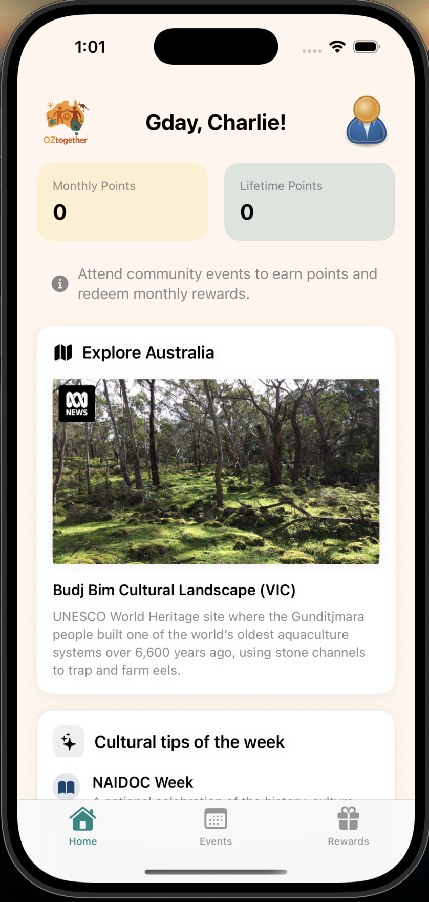
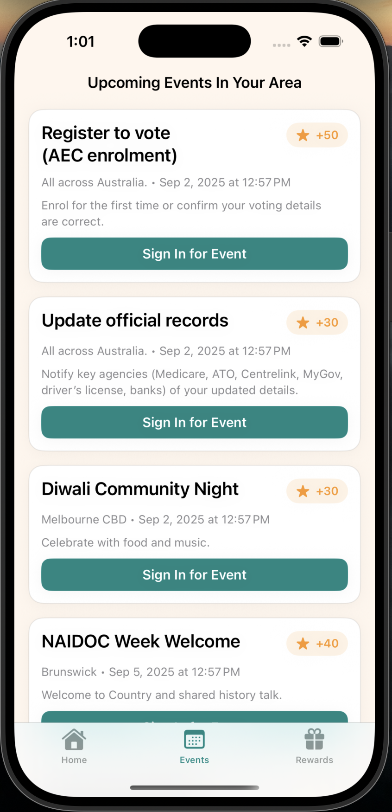
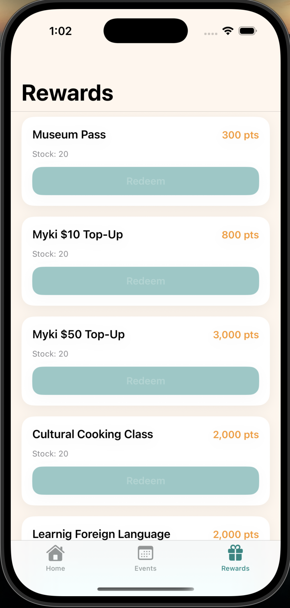

# OZtogether

OZtogether is a SwiftUI iOS app created for **GovHack 2025** to help new arrivals connect with Australian communities. Users can sign in, discover local events, earn points and redeem rewards while learning more about Australian culture.

## Screenshots

<table>
  <tr>
    <td align="center"> <b>Login Screen</b></td>
    <td align="center"> <b>Home Screen</b></td>
  </tr>
  <tr>
    <td align="center"> <b>Events Screen</b></td>
    <td align="center"> <b>Rewards Screen</b></td>
  </tr>
</table>

## Features

- **Easy sign‑in options**: log in with myGov or a phone number to start earning points right away.
- **Personal dashboard**: track monthly and lifetime points on the home screen alongside cultural tips and community spotlights.
- **Event check‑ins**: browse upcoming events, attend, and check in to collect points.
- **Redeemable rewards**: exchange points for transit top‑ups, museum passes, and other perks.
- **Shared data model**: a single `AppModel` manages user profile, events, rewards and point calculations across the app.

## Project Structure

- `App/` – application entry point and root view coordination.
- `Services/` – `AppModel` containing all business logic and sample data.
- `Views/` – SwiftUI screens for login, home, events, rewards and tabs.
- `Theme/` – reusable colors and date formatting.
- `Assets.xcassets/` – image and icon resources.
- `docs/images/` – placeholder folder for future screenshots.

## Getting Started

1. Open `OZtogether.xcodeproj` in Xcode 15 or later.
2. Select an iOS simulator or device and run the app.
3. Sign in to explore events, collect points and redeem rewards.

## License

_Add license information here._

## Acknowledgements

Built for **GovHack 2025**.

